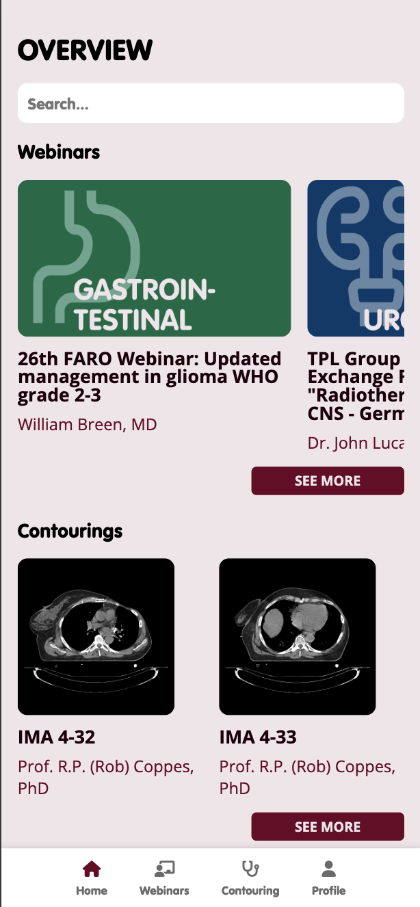
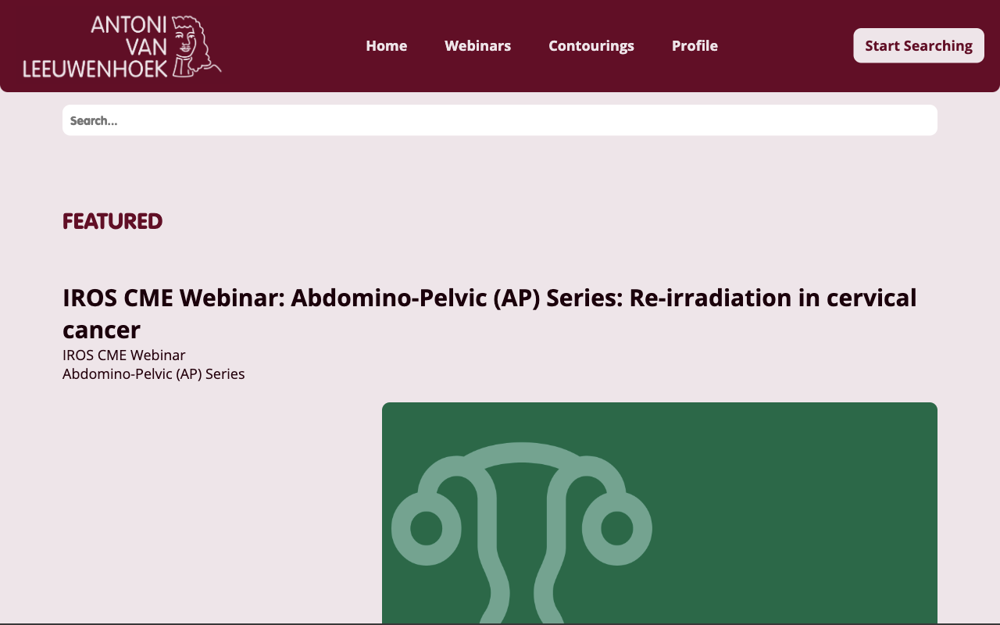
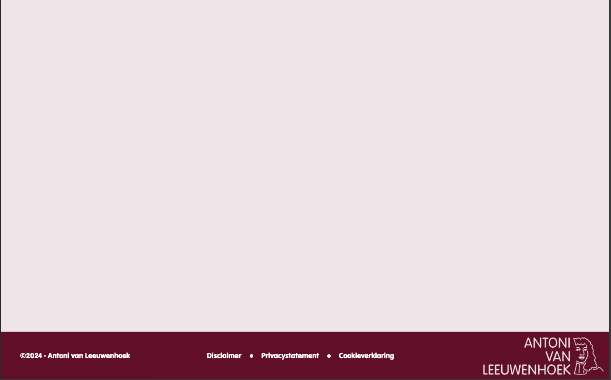

# The Client - Website
Ik ben Branco van Beek en ik doe de studie Front-end Design & Webdevelopment en ik heb gekozen voor het project Oncollaboration, dat is een ontwerp voor een online platform voor samenwerking en kennisdeling tussen Indoneschische en Nederlandse radiotherapeuten. Oncollaboration is het afstudeerwerk van oud-CMD student Sergio Eijben. Sergio is in opdracht van radiotherapeute Judi van Diessen van het Antoni van Leeuwenhoek ziekenhuis afgestudeerd op de vraag over hoe de samenwerking en kennisdeling tussen Indoneschische en Nederlandse radiotherapeuten te verbeteren. Onze opdracht is dan om op basis van het aangeleverde ontwerp het online platform Oncollabration te ontwikkelen. Ik heb gekozen om een website te maken voor het Antoni van Leeuwenhoek ziekenhuis in Amsterdam om kennis op het gebied van radiotherapie te delen met de Indonesische ziekenhuizen.

## Inhoudsopgave Readme

  * [Beschrijving](#beschrijving)
  * [Kenmerken](#kenmerken)
  * [Bronnen](#bronnen)

## Beschrijving

<a href="https://brancovanbeek.github.io/the-client-website/">Mijn website</a>

## Kenmerken
<!-- Bij Kenmerken staat welke technieken zijn gebruikt en hoe. Wat is de HTML structuur? Wat zijn de belangrijkste dingen in CSS? Wat is er met Javascript gedaan en hoe? Misschien heb je een framwork of library gebruikt? -->

